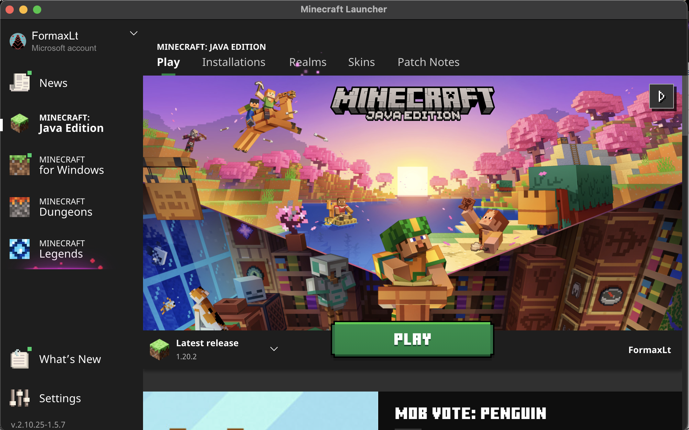
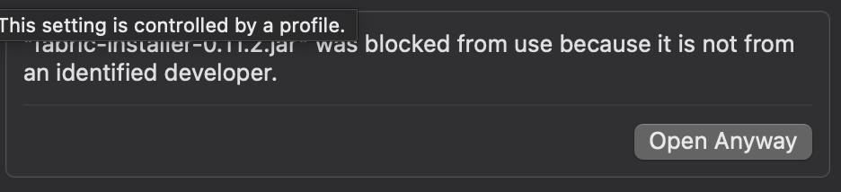
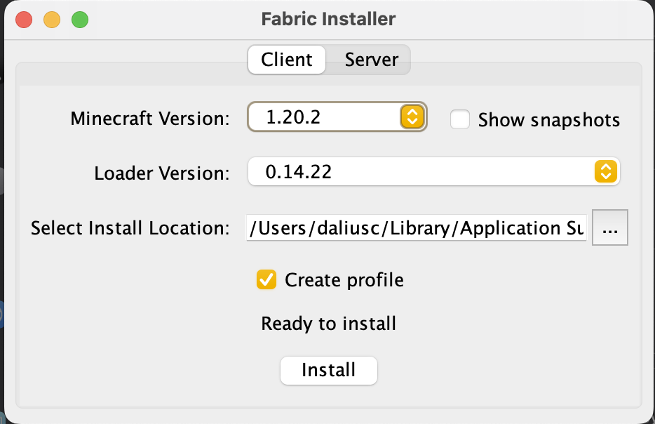
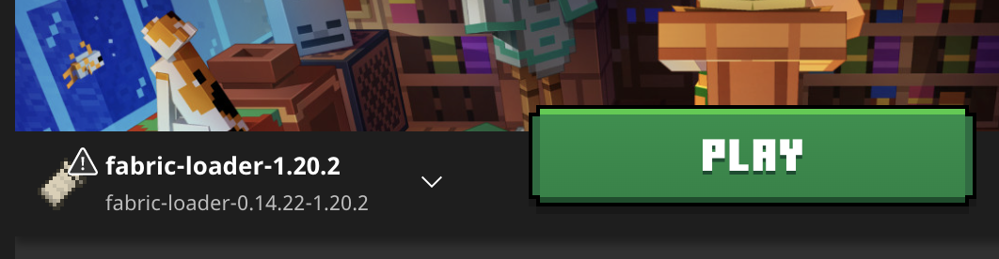
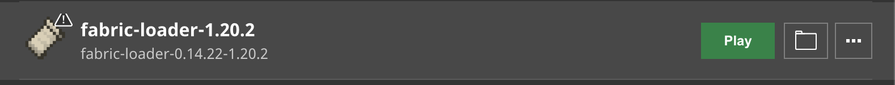
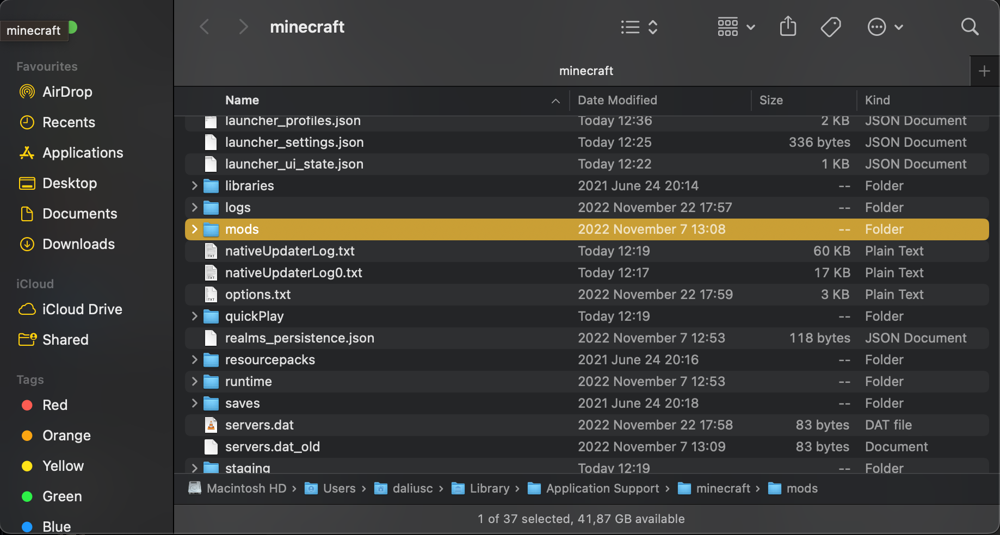
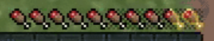
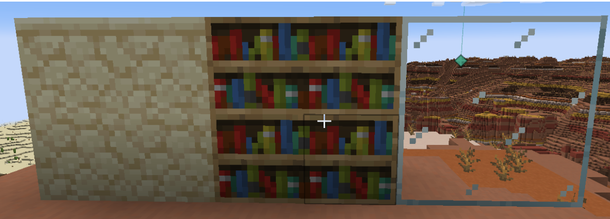

# Minecraft maksimalaus našumas

## Žingsniai

### Minecraft

1. Nusipirkti ir parsisiųsti Minecraft JAVA versiją iš https://www.minecraft.net/en-us. Pasikartosiu, JAVA, ne bedrock. Nepirkit bedrock, trash.
2. Parsisiuntus, pasileiskit minecraft launcher, prisijunkite prie savo paskyros. Galutinis vaizdas, turėtų atrodyti šitaip:

### Fabric

1. Jeigu įjungtas minecraft launcheris, išjunkit jį.
2. Parsisiunčiam [Fabric](https://maven.fabricmc.net/net/fabricmc/fabric-installer/0.11.2/fabric-installer-0.11.2.jar).
3. Double-clickinam .jar failą. Jeigu per macOS nieko nenutiko, tai reikia leisti šio failo paleidimą per security nustatymus.

Spaudžiam "Open Anyway"
4. Įsijungus lentelei, patikrinam ar minecraft versija yra teisinga (1.20.1 arba aukstesne, t.y. 1.20.X)
 
5. Spaudžiame install.
6. Po instaliacijos, įsijungiam minecraft launcher ir patikrinam ar atsirado naujas Fabric profilis (Jis yra prie play mygtuko ir turėtų atrodyti kažkas panašaus į šitai): 

### Mods

Prieš instaliuojant modifikacijas, reikia mums minecraft folderyje susikurti mods folderį.

1. Įjungtam minecraft launcheryje susirandam Installations mygtuka ir jį paspaudžiam 
2. Susirandam `fabric-loader` ir dešinėje paspaudžiam folderio ikoną .
3. Kai atsidaro minecraft folderis, jame sukuriame mods folderį . Į čia mes kelsime visas modifikacijas.

Pridėjau mods.zip, kuriame sudėti visi optional ir neoptional modai. Tai jeigu kažkurio nenorite, tiesiog išsiimkite arba įrašykite rankomis :)

#### Fabric API

Kad veiktų daugelis modifikacijų, mums reikia parsisiųsti ir įsidėti `Fabric API`.

1. Parsisiunčiam [Fabric API](https://www.curseforge.com/minecraft/mc-mods/fabric-api/download/4787714)
2. Parsisiųstą .jar failą įkeliame (neįjungiame) į sukurtą mods folderį.

#### Sodium

Tai yra didžiausias optimizavimo modas. Java versijos minecraft yra limituojamas CPU, beveik GPU nėra naudojamas. Kvaili developeriai!!! Bet šita modifikacija tai pakeičia ir pajungia GPU į darbą, tad dėl to ir žaidimas veiks žymiai geriau.

Instaliacija yra lygiai tokia pati kaip ir `Fabric API`. Parsisiųsti sodium .jar failą galima iš čia: [Sodium](https://cdn.modrinth.com/data/AANobbMI/versions/bbP1qBMr/sodium-fabric-mc1.20.2-0.5.3.jar)

### Neprivalomi mods

Tikrai užtenka Sodium, kad minecraft veiktų žymiai geriau, bet tiems, kas nori dar geresnės patirties, patarčiau ir šituos susiinstaliuoti.

Daug nesiplėsiu ką jie daro, tik minimaliai pabandysiu paaiškinti.

| Pavadinimas    | Paaiškinimas |
| -------- | ------- |
| [Dynamic FPS](https://www.curseforge.com/minecraft/mc-mods/dynamic-fps/download/4773500)  | Minecraft veiks lėčiau, jeigu jis bus paleistas tik backgrounde (t.y. bus nesufokusuotas), tai jeigu browsinsit internetą, ne taip lagins kompiuteris    |
| [Indium](https://cdn.modrinth.com/data/Orvt0mRa/versions/Lue6O9z9/indium-1.0.27%2Bmc1.20.1.jar) |  Reikalingas, kad kiti modai galetų veikti, po `Sodium` API pakeitimų   |
|  [Iris](https://cdn.modrinth.com/data/YL57xq9U/versions/Zra3j4VJ/iris-mc1.20.2-1.6.9.jar)   |   Tai yra šešėlių modas (IR GALBŪT prideda blokų švietimą rankoje, bet gal meluoju). Patarčiau šešėlius pasileisti tik ant M1 laptopų arba namie ant stalinio PC. Paprasčiausiai būtų parsisiųsti šitus [šešėlius](https://www.complementary.dev/shaders/) |
| [AppleSkin](https://cdn.modrinth.com/data/EsAfCjCV/versions/JNKPokGG/appleskin-fabric-mc1.20.2-2.5.1.jar) | Šitas modas parodo kiek papildomo maisto turit, iki kol pradės jūsų maistas žemėt. Tai yra paslėptas minecraft kintamasis, ir šitas modas jį parodo vizualiai. Atrodo šitaip  |
| [Chat heads](https://cdn.modrinth.com/data/Wb5oqrBJ/versions/UKq8ujMV/chat_heads-0.10.22-fabric-1.20.2.jar) | Kinda useless, bet fun modas, kuris rodo žmogaus skiną chate |
| [Continuity](https://cdn.modrinth.com/data/1IjD5062/versions/JXhQlDZl/continuity-3.0.0-beta.4%2B1.20.2.jar) | Sujungia kai kuriuos blokus į viena, kad geriau atrodytų  |
| [Entity culling](https://cdn.modrinth.com/data/NNAgCjsB/versions/BDwHAdWc/entityculling-fabric-1.6.2-mc1.20.1.jar) | Optimizacija. Nepiešia išmestų blokų, monstrų, gyvunų ir t.t., kurių nematai |
| [Ferrite core](https://cdn.modrinth.com/data/uXXizFIs/versions/FCnCG6PS/ferritecore-6.0.0-fabric.jar) | Sumažina ram naudojimą |
| [Jade](https://cdn.modrinth.com/data/nvQzSEkH/versions/o2sXK6XR/Jade-1.20.2-fabric-12.1.3.jar) | Duoda informacijos, į kokį bloką žiūri, su kuo jį gali sunaikinti ir ar tavo dabartinis daiktas yra pakankamai geras, kad jį sunaikinus, gautum.  |
| [LambDynamicLights](https://cdn.modrinth.com/data/yBW8D80W/versions/mYl4RvKg/lambdynamiclights-2.3.2%2B1.20.1.jar) | Blokai kurie šviečia padėti (torchai, glowstone ir panašiai), šviečia taip pat, kai jie yra laikomi rankoje arba yra išmesti ant žemės |
| [Xaero's minimap](https://www.curseforge.com/minecraft/mc-mods/xaeros-minimap/download/4768152) | Prideda minimap į žaidimą, galima užsidėti waypoints, kad būtų lengviau susigaudyt kur esi |
| [Xaero's world map](https://www.curseforge.com/minecraft/mc-mods/xaeros-world-map/download/4763285) | Minimap papildymas, leidžiantis pažiūrėti visą pasaulį (vietas kur esate aplankę patys) |
| [Not enough animations](https://cdn.modrinth.com/data/MPCX6s5C/versions/4QkMRJ1H/notenoughanimations-fabric-1.6.4-mc1.20.2.jar) | Prideda daugiau animacijų į žaidimą |
| [Zoomify](https://cdn.modrinth.com/data/w7ThoJFB/versions/QRQLkNPJ/Zoomify-2.12.0.jar) | Prideda in-game zoom, leidžianti priartinti į tai ką žiūri, vienu mygtuko paspaudimu! Reikia ir papildomų modų, kad šitas veiktų |
| [Fabric language kotlin](https://www.curseforge.com/minecraft/mc-mods/fabric-language-kotlin/download/4719981) | Reikia, jeigu naudojate `Zoomify` |
| [Yet another config lib](https://cdn.modrinth.com/data/1eAoo2KR/versions/u6jV7Q7R/yet-another-config-lib-fabric-3.2.1%2B1.20.2.jar) | Reikia, jeigu naudojate `Zoomify` |
| [Roughly Enough Items](https://www.curseforge.com/minecraft/mc-mods/roughly-enough-items/download/4774397) | Rodo visus žaidimo itemus dešinėje pusėje, atidarius savo inventory. Taip pat, galima pažiūrėti to daikto receptą (paspaudus R raidę ant jo) arba pažiūrėti, kur tas daiktas yra naudojamas, kituose receptuose (paspaudus U raidę). Reikia ir papildomų modų, kad šitas veiktų |
| [Architectury API](https://www.curseforge.com/minecraft/mc-mods/architectury-api/download/4769411) | Reikia, jeigu naudosit `Roughly Enough Items` |

